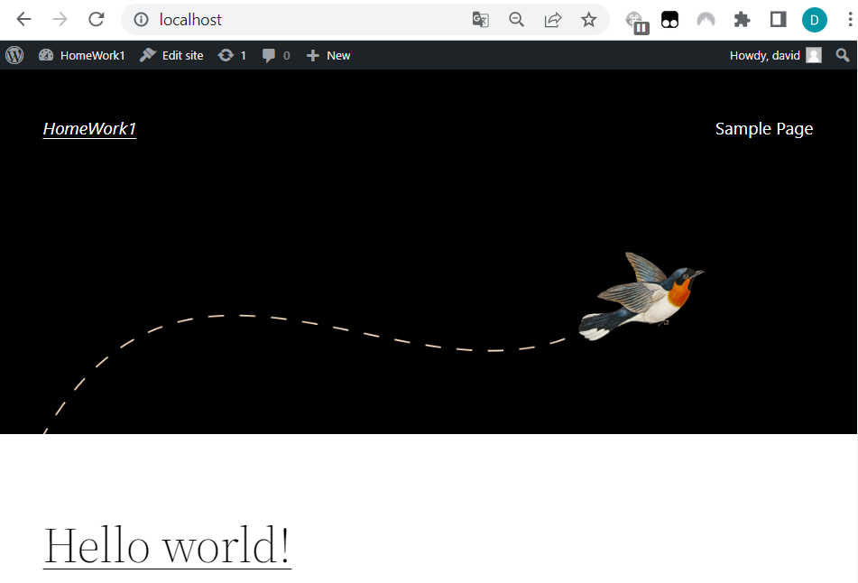

截圖

想法:

- wordpress 與 mysql 的部分
  - `mysql-config` : 將需要保密的資訊(帳號密碼)透過 Secrect 的方式掛入, host 與 name 則使用 ConfigMap
   - `mysql-deployment` : 
     - 包含 pod 跟 service 兩個部分, 從 Secret 與 ConfigMap 讀入需要的環境變數
     - restartPolicy: OnFailure 為了避免DB資料損毀, 所以設成有錯誤時才重啟
   - `wordpress-deployment` : 包含 pod 跟 service 兩個部分, 從 Secret 與 ConfigMap 讀入需要的環境變數
   - 確認 wordpress 與 mysql 是否能正常運作

- nginx 與 fluentd
  - `nginx-deplyment`: 放兩個服務在同一個pod中, 可以較快速收集log
  - `nginx-config, fluentd-config` : 設定檔放在 cobfigmap, 當需要更新可以不用改動　yaml